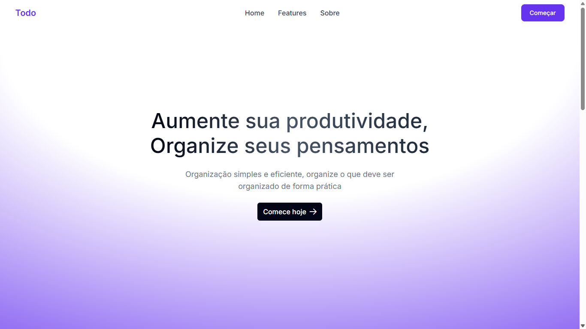

# 📝 Todo App — Angular + .NET + PostgreSQL (com Docker)

Aplicação de tarefas (To-do) full stack utilizando **Angular 19**, **.NET 9**, **PostgreSQL** e **Docker**.

Este projeto foi desenvolvido com o objetivo principal de ter o primeiro contato com **Angular** tendo apenas experiência com React e praticar a **integração com back-end** usando tecnologias como **.NET** e **PostgreSQL**. O foco foi no **frontend**, com landing page moderna e interface **responsiva** usando **Tailwind** e componentes **Prime NG**. É um projeto simples, voltado para estudo e prática de integração entre camadas.

---

<p align="center">
  
</p>

<p align="center">
  
</p>

<p align="center">
  
  
</p>

---

## 🚀 Tecnologias

- **Frontend:** Angular v19 + Tailwind v4 + PrimeNG  
- **Backend:** ASP.NET 9 (Web API) + Swagger   
- **Banco de Dados:** PostgreSQL  
- **Infra:** Docker 

---

## 🐳 Como rodar com Docker Compose

### Pré-requisitos

- [Docker](https://www.docker.com/)  

### Passos

```bash
# Clone o repositório
git clone https://github.com/rodrigvues/todo-app.git
cd /caminho/para/o/todo-app

# Inicie os containers
docker-compose up --build
```

### Acessos

- 🖥️ Frontend: [http://localhost:4200](http://localhost:4200)  
- 🛠️ API (Backend): [http://localhost:5121/api/todo](http://localhost:5121/api/todo) ou [http://localhost:5121/swagger](http://localhost:5121/swagger)

---

## 📦 Estrutura do Projeto

```
todo-app/
├── frontend/           # Angular + Tailwind + PrimeNG
│   ├── Dockerfile
│   └── nginx.conf
├── backend/            # ASP.NET 9 Web API
│   └── Dockerfile
├── docker-compose.yml  # Orquestração dos containers
└── README.md
```

---

## 🗄️ Banco de Dados (PostgreSQL)

Criado automaticamente pelo Docker Compose.

- **Nome:** `tododb`  
- **Porta:** `5432`  
- **Usuário/Senha:** `postgres` / `postgres`  

#### String de conexão (`appsettings.json`):

```json
"DefaultConnection": "Host=postgres;Port=5432;Database=tododb;Username=postgres;Password=postgres"
```

---

## ✅ Funcionalidades

- Criar novas tarefas  
- Listar tarefas pendentes e concluídas  
- Marcar como concluída  
- Excluir tarefas  

---

## 👨‍💻 Sobre o Projeto

Este é um projeto open-source criado com fins educacionais. Sinta-se à vontade para estudar, modificar e contribuir.

Desenvolvido por **Vitor Rodrigues**  
📧 Email: [rodrigvues@gmail.com]  
🔗 LinkedIn: [https://linkedin.com/in/rodrigvues](https://linkedin.com/in/rodrigvues)

